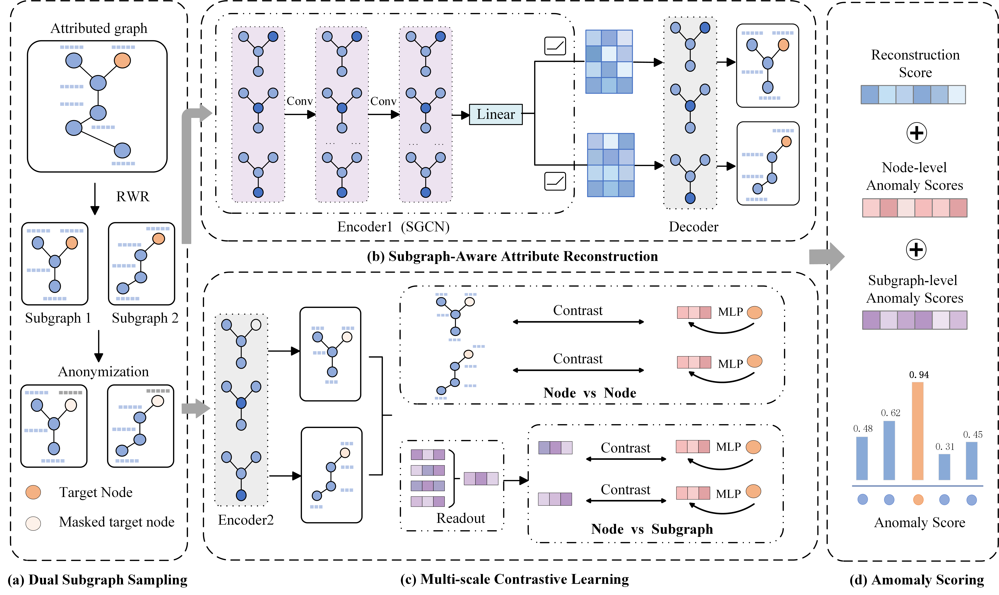

# Self-Supervised Graph Anomaly Detection via Reconstruction Enhancement and Multiscale Contrastive Learning

This is the source code of Information Sciences paper [Self-Supervised Graph Anomaly Detection via Reconstruction Enhancement and Multiscale Contrastive Learning] (GADREMC). 



## Requirements
+ python==3.8 
+ dgl==0.4.3
+ matplotlib==3.7.5
+ networkx==2.8.8
+ numpy==1.23.5
+ pyparsing==2.4.7
+ scikit-learn==1.0.2
+ scipy==1.10.1
+ sklearn==0.24.1
+ torch==2.0.0    
+ tqdm==4.67.1

To install all requirements:


## Usage
To train and evaluate on BlogCatalog:
```
python run.py --device cuda:0 --expid 1 --dataset BlogCatalog  --auc_test_rounds 256 --alpha 0.6 --beta 0.6  --gamma 0.6
```
To train and evaluate on Flickr:
```
python run.py --device cuda:0 --expid 2 --dataset Flickr  --auc_test_rounds 256 --alpha 0.8 --beta 0.6  --gamma 0.0
```
To train and evaluate on ACM:
```
python run.py --device cuda:0 --expid 3 --dataset ACM  --auc_test_rounds 256 --alpha 0.6 --beta 0.2  --gamma 0.8
```
To train and evaluate on Cora:
```
python run.py --device cuda:0 --expid 4 --dataset cora  --auc_test_rounds 256 --alpha 1.0 --beta 0.6  --gamma 0.0
```
To train and evaluate on CiteSeer:
```
python run.py --device cuda:0 --expid 5 --dataset citeseer  --auc_test_rounds 256 --alpha 0.8 --beta 0.6  --gamma 0.2
```
To train and evaluate on PubMed:
```
python run.py --device cuda:0 --expid 6 --dataset pubmed  --auc_test_rounds 256 --alpha 0.6 --beta 0.2  --gamma 0.0
```


## Cite
If you use our code in your research, please cite the following article:
```
```
